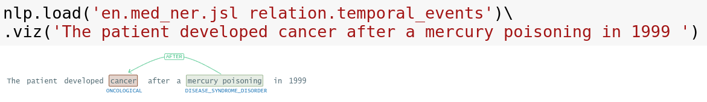

# John Snow Labs: State-of-the-art NLP in Python

The John Snow Labs library provides a simple & unified Python API for delivering enterprise-grade natural language processing solutions:
1. 15,000+ free NLP models in 250+ languages in one line of code. Production-grade, Scalable, trainable, and 100% open-source.
2. Open-source libraries for Responsible AI (NLP Test), Explainable AI (NLP Display), and No-Code AI (NLP Lab).
3. 1,000+ healthcare NLP models and 1,000+ legal & finance NLP models with a John Snow Labs license subscription.

Homepage: https://www.johnsnowlabs.com/

Docs & Demos: https://nlp.johnsnowlabs.com/


## Features

Powered by John Snow Labs Enterprise-Grade Ecosystem:

- 🚀 [Spark-NLP](https://www.johnsnowlabs.com/spark-nlp/) :  State of the art NLP at scale!
- 🤖 [NLU](https://github.com/JohnSnowLabs/nlu) : 1 line of code to conquer NLP!
- 🕶 [Visual NLP](https://www.johnsnowlabs.com/visual-nlp/) : Empower your NLP with a set of eyes!
- 💊 [Healthcare NLP](https://www.johnsnowlabs.com/healthcare-nlp/) :  Heal the world with NLP!
- ⚖ [Legal NLP](https://www.johnsnowlabs.com/legal-nlp/) : Bring justice with NLP!
- 💲 [Finance NLP](https://www.johnsnowlabs.com/finance-nlp/) : Understand Financial Markets with NLP!
- 🎨 [NLP-Display](https://github.com/JohnSnowLabs/spark-nlp-display)  Visualize and Explain NLP!
- 📊 [NLP-Test](https://github.com/JohnSnowLabs/nlptest) : Deliver Reliable, Safe and Effective Models!
- 🔬 [Gen-AI-lab](https://www.johnsnowlabs.com/generative-ai-healthcare/) : No-Code Tool to Annotate & Train new Models!

## Installation

```python
! pip install johnsnowlabs

from johnsnowlabs import nlp
nlp.load('emotion').predict('Wow that was easy!')

```

See [the documentation](https://nlp.johnsnowlabs.com/docs/en/install) for more details.


## Usage

These are examples of getting things done with one line of code.
See the [General Concepts Documentation](https://nlp.johnsnowlabs.com/docs/en/concepts) for building custom pipelines.

```python
# Example of Named Entity Recognition
nlp.load('ner').predict("Dr. John Snow is an British physician born in 1813")
```

Returns :

| entities  | entities_class | entities_confidence | 
|-----------|----------------|:--------------------|
| John Snow | PERSON         | 0.9746              | 
| British   | NORP           | 0.9928              | 
| 1813      | DATE           | 0.5841              | 

```python
# Example of Question Answering 
nlp.load('answer_question').predict("What is the capital of Paris")
```

Returns :

| text                          | answer | 
|-------------------------------|--------|
| What is the capital of France | Paris  | 

```python
# Example of Sentiment classification
nlp.load('sentiment').predict("Well this was easy!")
```

Returns :

| text                | sentiment_class | sentiment_confidence | 
|---------------------|-----------------|:---------------------|
| Well this was easy! | pos             | 0.999901             | 


```python
nlp.load('ner').viz('Bill goes to New York')
```
Returns:    

For a full overview see the [1-liners Reference](https://nlp.johnsnowlabs.com/docs/en/examples) and [the Workshop](https://github.com/JohnSnowLabs/spark-nlp-workshop).


## Use Licensed Products

To use John Snow Labs' paid products like [Healthcare NLP](https://www.johnsnowlabs.com/healthcare-nlp), [Visual NLP], [Legal NLP], or [Finance NLP], get a license key and then call nlp.install() to use it:


```python
! pip install johnsnowlabs
# Install paid libraries via a browser login to connect to your account
from johnsnowlabs import nlp
nlp.install()
# Start a licensed session
nlp.start()
nlp.load('en.med_ner.oncology_wip').predict("Woman is on  chemotherapy, carboplatin 300 mg/m2.")
```

## Usage 

These are examples of getting things done with one line of code.
See the [General Concepts Documentation](https://nlp.johnsnowlabs.com/docs/en/concepts) for building custom pipelines.


```python
# visualize entity resolution ICD-10-CM codes 
nlp.load('en.resolve.icd10cm.augmented')
    .viz('Patient with history of prior tobacco use, nausea, nose bleeding and chronic renal insufficiency.')
```
returns:        


```python
# Temporal Relationship Extraction&Visualization
nlp.load('relation.temporal_events')\
    .viz('The patient developed cancer after a mercury poisoning in 1999 ')
```
returns:


## Helpful Resources
Take a look at the official Johnsnowlabs page page: [https://nlp.johnsnowlabs.com](https://nlp.johnsnowlabs.com/)  for user documentation and examples


| Resource                                                                                                            |                                Description|
|----------------------------------------------------------------------------------------------------------------------|-------------------------------------------|
| [General Concepts](https://nlu.johnsnowlabs.com/docs/en/concepts)                                                    | General concepts in the Johnsnowlabs library
| [Overview of 1-liners](https://nlu.johnsnowlabs.com/docs/en/examples)                                                | Most common used models and their results
| [Overview of 1-liners for healthcare](https://nlu.johnsnowlabs.com/docs/en/examples_hc)                              | Most common used healthcare models and their results 
| [Overview of all 1-liner Notebooks](https://nlu.johnsnowlabs.com/docs/en/notebooks)                                  | 100+ tutorials on how to use the 1 liners on text datasets for various problems and from various sources like Twitter, Chinese News, Crypto News Headlines, Airline Traffic communication, Product review classifier training,
| [Connect with us on Slack](https://join.slack.com/t/spark-nlp/shared_invite/zt-lutct9gm-kuUazcyFKhuGY3_0AMkxqA)      | Problems, questions or suggestions? We have a  very active and helpful community of over 2000+ AI enthusiasts putting Johnsnowlabs products to good use
| [Discussion Forum](https://github.com/JohnSnowLabs/spark-nlp/discussions)                                            | More indepth discussion with the community? Post a thread in our discussion Forum
| [Github Issues](https://github.com/JohnSnowLabs/nlu/issues)                                                          | Report a bug
| [Custom Installation](https://nlu.johnsnowlabs.com/docs/en/install_advanced)                                         | Custom installations, Air-Gap mode and other alternatives   
| [The `nlp.load(<Model>)` function](https://nlu.johnsnowlabs.com/docs/en/load_api)                                    | Load any model or pipeline in one line of code
| [The `nlp.load(<Model>).predict(data)`  function](https://nlu.johnsnowlabs.com/docs/en/predict_api)                  | Predict on  `Strings`, `List of Strings`, `Numpy Arrays`, `Pandas`, `Modin` and  `Spark Dataframes`
| [The `nlp.load(<train.Model>).fit(data)`  function](https://nlu.johnsnowlabs.com/docs/en/training)                   | Train a text classifier for  `2-Class`, `N-Classes` `Multi-N-Classes`, `Named-Entitiy-Recognition` or `Parts of Speech Tagging`
| [The `nlp.load(<Model>).viz(data)`  function](https://nlu.johnsnowlabs.com/docs/en/viz_examples)                     | Visualize the results of `Word Embedding Similarity Matrix`, `Named Entity Recognizers`, `Dependency Trees & Parts of Speech`, `Entity Resolution`,`Entity Linking` or `Entity Status Assertion` 
| [The `nlp.load(<Model>).viz_streamlit(data)`  function](https://nlu.johnsnowlabs.com/docs/en/streamlit_viz_examples) | Display an interactive GUI which lets you explore and test every model and feature in Johnsowlabs 1-liner repertoire in 1 click.


## License
This library is licensed under the [Apache 2.0](https://github.com/JohnSnowLabs/johnsnowlabs/blob/main/LICENSE) license.
John Snow Labs' paid products are subject to this [End User License Agreement](https://www.johnsnowlabs.com/health-nlp-spark-ocr-libraries-eula/).        
By calling nlp.install() to add them to your environment, you agree to its terms and conditions.


