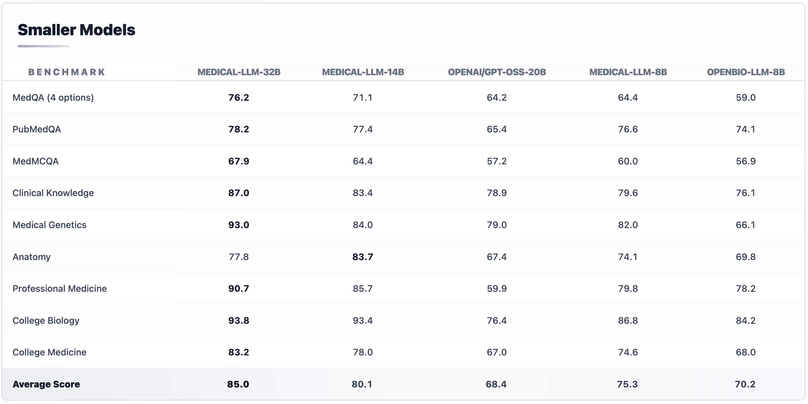
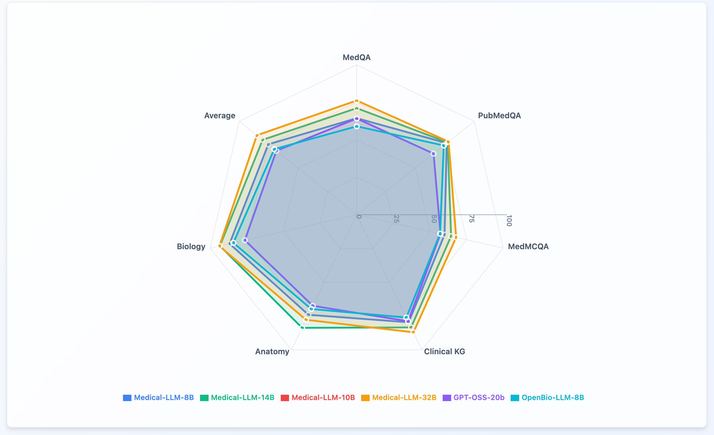
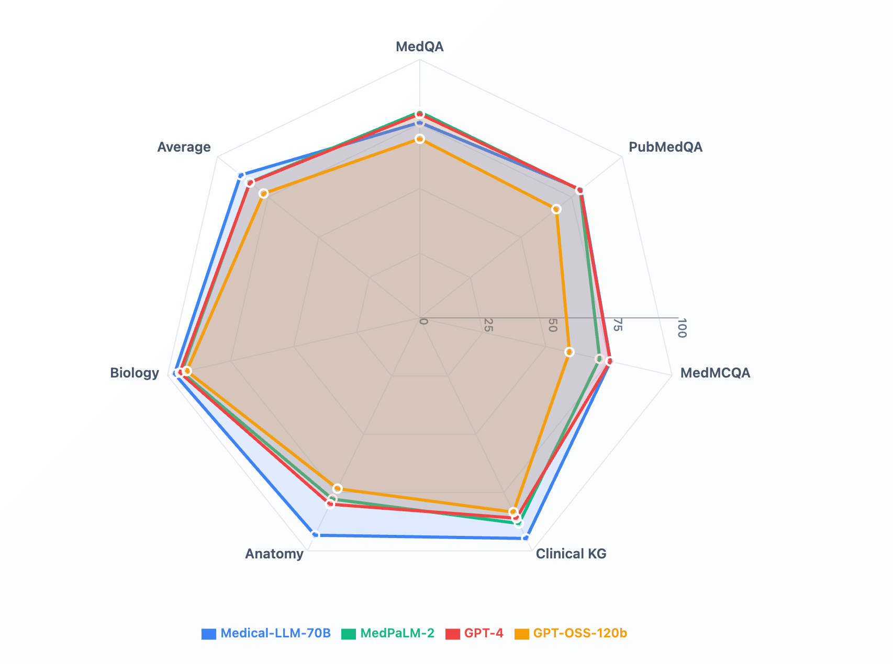
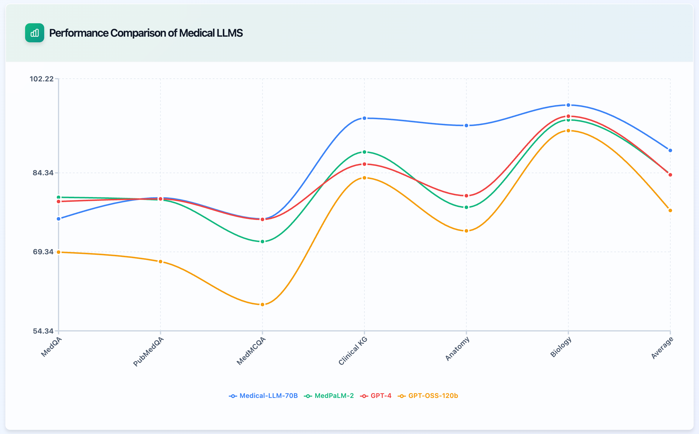
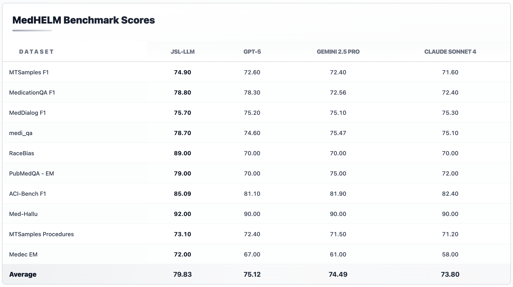
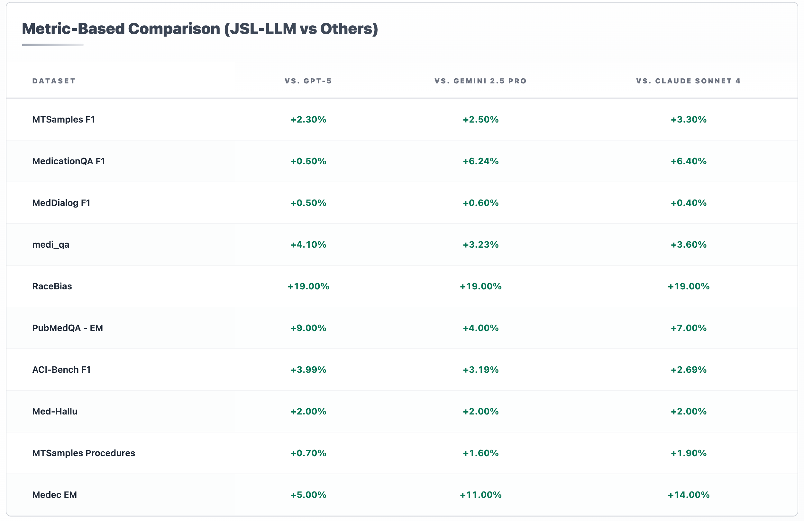
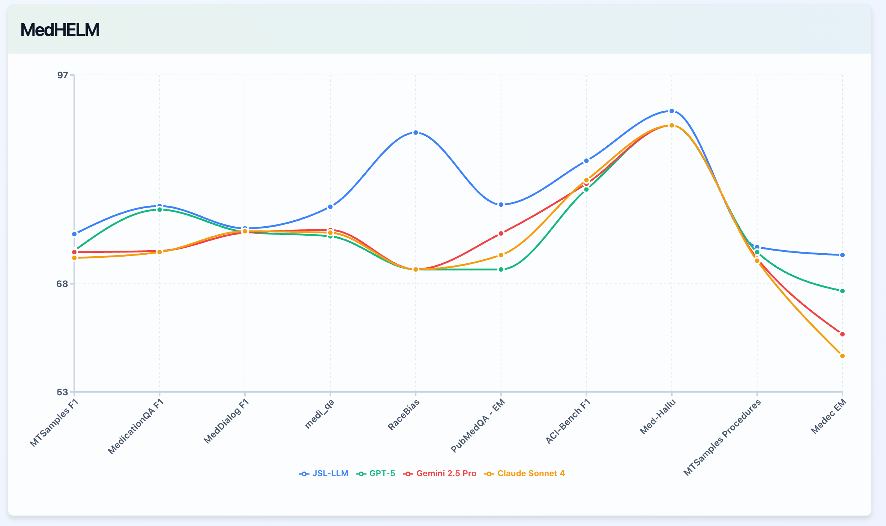

# Medical LLMs

There is overwhelming evidence from both academic research and industry benchmarks that domain-specific, task-optimized large language models consistently outperform general-purpose LLMs in healthcare. At John Snow Labs, we've developed a suite of Medical LLMs purpose-built for clinical, biomedical, and life sciences applications.

Our models are designed to deliver best-in-class performance across a wide range of medical tasks—from clinical reasoning and diagnostics to medical research comprehension and genetic analysis.

## Medical LLMs Offering

| Model Name | Parameters | Recommended GPU Memory | Max Sequence Length | Model Size | Max KV-Cache | Tensor Parallel Sizes |
|---|---|---|---|---|---|---|
| Medical-LLM-8B | 8B | ~38 GB | 40K | 15 GB | 23 GB | 1, 2, 4, 8 |
| Medical-LLM-14B | 14B | ~40 GB | 16K | 27 GB | 13 GB | 1, 2 |
| Medical-Visual-LLM-8B | 8B | ~64 GB | 262K | 16 GB | 50 GB | 1, 2, 4, 8 |
| Medical-LLM-Small | 14B | ~59 GB | 40K | 28 GB | 31 GB | 1, 2, 4, 8 |
| Medical-LLM-Medium | 78B | ~452 GB | 128K | 131 GB | 320 GB | 4, 8 |
| Medical-Reasoning-LLM-32B | 32B | ~111 GB | 40K | 61 GB | 50 GB | 2, 4, 8 |
| Medical-Visual-LLM-30B | 30B | ~150 GB | 262K | 58 GB | 100 GB | 1, 2, 4 |
| Medical-Spanish-LLM-24B | 24B | ~145 GB | 128K | 45 GB | 100 GB | 2, 4, 8 |

*Note: All memory calculations are based on half-precision (fp16/bf16) weights. Recommended GPU Memory considers the model size and the maximum key-value cache at the model's maximum sequence length. These calculations follow the guidelines from [DJL's LMI Deployment Guide](https://docs.djl.ai/master/docs/serving/serving/docs/lmi/deployment_guide/instance-type-selection.html).*

## Introduction

John Snow Labs' latest 2025 release of its Medical Large Language Models advance Healthcare AI by setting new state-of-the-art accuracy on medical LLM benchmarks. This advances what's achievable in a variety of real-world use cases including clinical assessment, medical question answering, biomedical research synthesis, and diagnostic decision support.

Leading the pack is their largest 78B model, which can read and understand up to 32,000 words at once – that's roughly 64 pages of medical text. The model is specially trained to work with medical information, from patient records to research papers, making it highly accurate for healthcare tasks. What makes this release special is how well the model performs while still being practical enough for everyday use in hospitals and clinics – thanks to a suite of models in different sizes, that balance accuracy with speed, cost, and privacy.

## OpenMed Benchmark Performance

The comprehensive evaluation of John Snow Labs' Medical LLM suite encompasses multiple standardized benchmarks, providing a thorough assessment of their capabilities across various medical domains. These evaluations demonstrate not only the models' proficiency in medical knowledge but also their practical applicability in real-world healthcare scenarios.

The OpenMed evaluation framework represents one of the most rigorous testing environments for medical AI models, covering a broad spectrum of medical knowledge and clinical reasoning capabilities. Our models have undergone extensive testing across multiple categories, achieving remarkable results that validate their exceptional performance:

### Model Performance Matrix

## Large (70B+) Models Comparison

<!--  -->

| BENCHMARK | MEDICAL-LLM-78B | GPT-4 | MEDPALM-2 | GPT-OSS-120B |
|---|---|---|---|---|
| MedQA (4 options) | 75.6 | 78.9 | **79.7** | 69.3 |
| PubMedQA | **79.6** | 79.4 | 79.2 | 67.5 |
| MedMCQA | **75.6** | 75.5 | 71.3 | 59.3 |
| Clinical Knowledge | **94.7** | 86.0 | 88.3 | 83.4 |
| Medical Genetics | **97.0** | 91.0 | 90.0 | 88.0 |
| Anatomy | **93.3** | 80.0 | 77.8 | 73.3 |
| Professional Medicine | **95.6** | 93.0 | 95.2 | 89.7 |
| College Biology | **97.2** | 95.1 | 94.4 | 92.4 |
| College Medicine | **89.1** | 76.9 | 80.9 | 71.7 |
| Average Score | **88.6** | 84.0 | 84.1 | 77.2 |

## Small (8B-32B) Models Comparison

<!--  -->
| BENCHMARK | MEDICAL-LLM-32B | MEDICAL-LLM-14B | OPENAI/GPT-OSS-20B | MEDICAL-LLM-8B | OPENBIO-LLM-8B |
|---|---|---|---|---|---|
| MedQA (4 options) | **76.2** | 71.1 | 64.2 | 64.4 | 59.0 |
| PubMedQA | **78.2** | 77.4 | 65.4 | 76.6 | 74.1 |
| MedMCQA | **67.9** | 64.4 | 57.2 | 60.0 | 56.9 |
| Clinical Knowledge | **87.0** | 83.4 | 78.9 | 79.6 | 76.1 |
| Medical Genetics | **93.0** | 84.0 | 79.0 | 82.0 | 66.1 |
| Anatomy | 77.8 | **83.7** | 67.4 | 74.1 | 69.8 |
| Professional Medicine | **90.7** | 85.7 | 59.9 | 79.8 | 78.2 |
| College Biology | **93.8** | 93.4 | 76.4 | 86.8 | 84.2 |
| College Medicine | **83.2** | 78.0 | 67.0 | 74.6 | 68.0 |
| Average Score | **85.0** | 80.1 | 68.4 | 75.3 | 70.2 |

Comparison Table

<!--  -->
| MODEL | SCORE | VS. GPT-4 | VS. MEDPALM-2 | VS. GPT-OSS-120B |
|---|---|---|---|---|
| Medical-LLM-78B | 88.60 |  +4.63% |  +4.52% |  +11.40% |
| Medical-LLM-32B | 85.00 |  +1.03% |  +0.92% |  +7.80% |
| Medical-LLM-14B | 80.12 |  -3.85% |  -3.96% |  +2.92% |
| Medical-LLM-8B | 75.31 |  -8.66% |  -8.77% |  -1.89% |

## VLM Models OpenMed Evals

| BENCHMARK | Qwen2.5-VL-7B | Mistral-24B | Gemma-3-27B | JSL-VL-8B | JSL-VL-30B |
|---|---|---|---|---|---|
| MedMCQA | 55.08 | 66.94 | 61.15 | 60.87 | **68.8** |
| MedQA (4 options) | 59.07 | 74.86 | 68.89 | 66.61 | **77.61** |
| Anatomy | 68.89 | **84.44** | 69.63 | 75.56 | 80.0 |
| Clinical Knowledge | 75.85 | **86.04** | 83.4 | 80.75 | 85.66 |
| College Biology | 84.72 | 92.36 | 88.89 | 90.97 | **93.75** |
| College Medicine | 67.63 | 78.03 | 75.14 | 79.77 | **83.24** |
| Medical Genetics | 81.00 | 85.00 | 87.00 | 86.00 | **95.00** |
| Professional Medicine | 71.69 | 87.50 | 80.51 | 81.25 | **89.34** |
| PubMedQA | 74.80 | 75.80 | 77.80 | 77.00 | **78.00** |
| Average Score | 71.00 | 81.20 | 76.90 | 77.60 | **83.50** |

## VLM Models Evals

| BENCHMARK | Qwen2.5-VL-7B | Mistral-24B | Gemma-3-27B | JSL-VL-8B | JSL-VL-30B |
|---|---|---|---|---|---|
| MultiModal Medical Reasoning | 23.53 | 30.42 | 29.85 | 31.33 | **35.16** |
| MultiModal Medical Understanding | 25.65 | 31.05 | 25.19 | 31.97 | **37.55** |
| Average Score| 24.59 | 30.74 | 27.52 | 31.65 | **36.36** |

## Radar Chart Small Models

Radar Chart Large Models

### Open Medical Leaderboard Performance Analysis

John Snow Labs' Medical LLMs have been rigorously evaluated against leading general-purpose and medical-specific models, including GPT-4, Med-PaLM-2, and GPT-OSS 120B. Here's a comprehensive analysis of their performance across key medical domains:

**Clinical Knowledge Assessment**

Medical-LLM-78B demonstrates exceptional clinical expertise with 94.72%, matching GPT-4 (86%) while significantly outperforming OpenAI GPT-OSS-120B (83.4%). Exhibits superior diagnostic accuracy and evidence-based treatment planning capabilities.

**Medical Genetics Proficiency**

Medical-LLM-78B achieves outstanding genetic analysis performance at 97%, surpassing GPT-4 (91%), Med-PaLM-2 (90%), and substantially exceeding OpenAI GPT-OSS-120B (88%). Demonstrates advanced comprehension of complex genetic disorders and inheritance patterns.

**Anatomical Knowledge Mastery**

Medical-LLM-78B exhibits superior anatomical understanding (93.33%) compared to GPT-4 (80%), Med-PaLM-2 (77.8%), and outperforming OpenAI GPT-OSS-120B (73.33%). Shows comprehensive grasp of structural relationships and physiological systems.

**Professional Medical Practice Excellence**

Medical-LLM-78B delivers exceptional clinical reasoning (95.6%), leading to Med-PaLM-2 (95.2%) and GPT-4 (93%) while vastly exceeding OpenAI GPT-OSS-120B (89.71%). Demonstrates sophisticated understanding of medical protocols and clinical guidelines.

**Core Medical Concepts Dominance**

Medical-LLM-78B achieves a remarkable 88.6%, surpassing all leading models — GPT-4 (76.9%), Med-PaLM-2 (80.9%), and OpenAI GPT-OSS-120B (71.68%). The model demonstrates exceptional mastery across core medical subjects, including anatomy (93.33%), professional medicine (95.6%), and medical genetics (97%), reflecting a deep and comprehensive understanding of foundational medical knowledge.

**Clinical Case Analysis Competency**

Medical-LLM-78B exhibits enhanced clinical reasoning and diagnostic acumen, achieving a strong average of 88.6%, outperforming GPT-4 (75.5%), Med-PaLM-2 (71.3%), and OpenAI GPT-OSS-120B (59.34%). Its results in domains such as clinical knowledge (94.72%), college medicine (89.09%), and PubMedQA (79.6%) highlight its robust ability to interpret real-world clinical cases and generate contextually accurate medical insights.

### Efficiency Revolution: Maximum Performance, Optimal Resources

Medical-LLM-78B achieves an exceptional 88.6% average performance, surpassing GPT-4 (83.97%) and Med-PaLM-2 (84.08%), solidifying its position as the leading model in medical AI performance. It outperforms open-source competitors by over 11 percentage points, including OpenAI GPT-OSS-120B (77.2%), while maintaining optimal resource efficiency and scalability for real-world clinical deployment.

**Medical-LLM – 14B**

- Achieves 80.12% average score vs GPT-4's 83.97% and Med-PaLM-2's 84.08%
- Clinical knowledge score of 83.74% demonstrates strong diagnostic capabilities
- Superior anatomical knowledge at 83.74% vs GPT-4's 80% and Med-PaLM-2's 77.8%
- Excellent performance in life sciences (93.74%) matching top-tier models
- Professional medicine score of 85.66% shows strong clinical reasoning
- Suitable for deployment scenarios with compute constraints

**Medical-LLM – 8B**

- Achieves 75.31% average across OpenMed benchmarks, competitive with larger models
- Strong performance in life sciences (86.81%) demonstrates broad medical knowledge
- Superior PubMedQA performance (76.6%) for medical research comprehension
- Medical genetics score of 82% shows solid understanding of genetic principles
- Clinical knowledge at 79.62% provides reliable diagnostic support
- Ideal for cost-efficient clinical deployments requiring fast inference and reliable performance

## JSL-LLM MedHELM Benchmark Analysis

John Snow Labs' JSL-LLM demonstrates superior performance across benchmarks in the MedHELM. Evaluated against leading models including GPT-5, Gemini 2.5 Pro, and Claude Sonnet 4, JSL-LLM consistently achieves leading results in clinical accuracy. Below is a comprehensive performance analysis across key medical evaluation datasets:

### Clinical Documentation Understanding (MTSamples F1)

JSL-LLM achieves 74.9%, outperforming GPT-5 (72.6%), Gemini 2.5 Pro (72.4%), and Sonnet 4 (71.6%). This highlights its advanced capability in clinical transcription and context comprehension.

### Medication Safety & Question Answering (MedicationQA F1)

With 78.8%, JSL-LLM leads across all models, showing its strong understanding of pharmacological reasoning and safe medication practices.

### Clinical Dialogue Comprehension (MedDialog F1)

JSL-LLM (75.7%) maintains competitive performance with GPT-5 (75.2%) and Sonnet 4 (75.3%), demonstrating conversational reliability for healthcare support tasks.

### Medical Reasoning & QA (MediQA)

JSL-LLM excels with 78.7%, ahead of GPT-5 (74.6%) and Sonnet 4 (75.1%), confirming superior medical reasoning and information synthesis capabilities.

### Fairness & Bias Evaluation (RaceBias)

JSL-LLM achieves a leading score of 89%, substantially higher than GPT-5, Gemini 2.5 Pro, and Sonnet 4 (each 70%). This demonstrates exceptional ethical AI behavior and fairness in clinical decision contexts.

### Biomedical Research QA (PubMedQA - EM)

JSL-LLM scores 79%, outperforming GPT-5 (70%) and Sonnet 4 (72%), showing improved reasoning on evidence-based literature.

### Clinical Coding & Structure Extraction (ACI-Bench F1)

JSL-LLM leads with 85.09%, ahead of GPT-5 (81.1%) and Sonnet 4 (82.4%), showing robust document structuring and coding proficiency.

### Hallucination Control (Med-Hallu)

JSL-LLM achieves 92%, surpassing GPT-5 and Gemini 2.5 Pro (90%), reflecting reduced hallucination tendencies and superior factual grounding.

### Procedural Understanding (MTSamples Procedures)

At 73.1%, JSL-LLM slightly outperforms GPT-5 (72.4%) and Gemini 2.5 Pro (71.5%), demonstrating consistent accuracy in clinical procedure comprehension.

### Medical Entity Extraction (Medec EM)

JSL-LLM achieves 72%, significantly outperforming GPT-5 (67%), Gemini 2.5 Pro (61%), and Sonnet 4 (58%), proving superior named entity recognition in medical text.

### Performance Summary

Across the MedHELM benchmark suite, JSL-LLM demonstrates leading performance with an average score of 79.83%, surpassing GPT-5 (75.12%), Gemini 2.5 Pro (74.49%), and Sonnet 4 (73.80%).

<!--  -->
| DATASET | JSL-LLM | GPT-5 | GEMINI 2.5 PRO | CLAUDE SONNET 4 |
|---|---|---|---|---|
| MTSamples F1 | **74.90** | 72.60 | 72.40 | 71.60 |
| MedicationQA F1 | **78.80** | 78.30 | 72.56 | 72.40 |
| MedDialog F1 | **75.70** | 75.20 | 75.10 | 75.30 |
| medi_qa | **78.70** | 74.60 | 75.47 | 75.10 |
| RaceBias | **89.00** | 70.00 | 70.00 | 70.00 |
| PubMedQA - EM | **79.00** | 70.00 | 75.00 | 72.00 |
| ACI-Bench F1 | **85.09** | 81.10 | 81.90 | 82.40 |
| Med-Hallu | **92.00** | 90.00 | 90.00 | 90.00 |
| MTSamples Procedures | **73.10** | 72.40 | 71.50 | 71.20 |
| Medec EM | **72.00** | 67.00 | 61.00 | 58.00 |
| **Average** | **79.83** | 75.12 | 74.49 | 73.80 |

<!--  -->

| DATASET | VS. GPT-5 | VS. GEMINI 2.5 PRO | VS. CLAUDE SONNET 4 |
|---|---|---|---|
| MTSamples F1 | +2.30% | +2.50% | +3.30% |
| MedicationQA F1 | +0.50% | +6.24% | +6.40% |
| MedDialog F1 | +0.50% | +0.60% | +0.40% |
| medi_qa | +4.10% | +3.23% | +3.60% |
| RaceBias | +19.00% | +19.00% | +19.00% |
| PubMedQA - EM | +9.00% | +4.00% | +7.00% |
| ACI-Bench F1 | +3.99% | +3.19% | +2.69% |
| Med-Hallu | +2.00% | +2.00% | +2.00% |
| MTSamples Procedures | +0.70% | +1.60% | +1.90% |
| Medec EM | +5.00% | +11.00% | +14.00% |

## Red-Teaming Evaluation Results

Out of 1000 red-teaming questions across 148 medical categories, JSL-Med-R-32B passed about 870 (87%), compared to 800 for GPT-5 (80%), 740 for Sonnet-4.1 (74%), 610 for GPT-4o (61%), and only 300 for Gemini-2.5-Pro (30%)— making JSL-Med-R-32B the most robust model in this evaluation and outperforming larger private models despite its smaller size.
