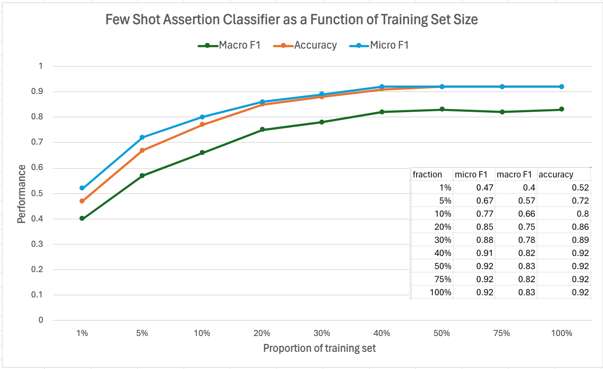

<div class="h3-box" markdown="1">

## 5.3.2

#### Highlights

We are delighted to announce remarkable enhancements and updates in our latest release of Spark NLP for Healthcare. **This release comes with a brand new Few-Shot Assertion Classifier Model, a few new annotators, the first BioLord based entity resolver, Pipeline Output Parser module, 4 new clinical pretrained models, and pipelines**. 

+ Introducing new Few-Shot Assertion Classifier Model for higher accuracy with less data
+ Introducing a new lightweight deidentification annotator `LightDeidentification` that avoids token input, verbose regex patterns, and unnecessary parameters.
+ BioLord based sentence entity resolver model for RxNorm terminologies
+ Explore the new annotator `MultiChunkToDoc` that merges chunks into documents to concat named entities into one piece.
+ Improved version of Social Determinants of Health (SDoH) named entity recognition model.
+ New Profiling Pipeline for De-identification to run multiple deidentification models at once in a single line.
+ `directionSensitive` and `filterByTokenDistance` parameters added to the `RelationExtraction` annotator to allow further customization and reduce FPs.
+ Efficiency analysis and cost evaluation of deidentification pipelines on cloud platforms.
+ Output parser to prettify Pretrained Pipeline outputs into structured JSONs/dictionaries.
+ Various core improvements; bug fixes, enhanced overall robustness and reliability of Spark NLP for Healthcare
    - Fixed issue with `WindowedSentenceModel` not being imported correctly from the `sparknlp_jsl.annotator` module
    - Addressed inconsistent obfuscation behavior in the deidentification annotator on DataProc, where different fake names were produced despite using the same seed value across runs
    - Solved compatibility issue between MPNetEmbeddings and SentenceEntityResolverModel in Spark NLP for Healthcare, where the resolver fails due to missing token metadata from MPNetEmbeddings.
+ Updated notebooks and demonstrations for making Spark NLP for Healthcare easier to navigate and understand
    - New [MEDDRA Resolver Demo](https://demo.johnsnowlabs.com/healthcare/ER_MEDDRA/)
    - New [Oncological Response to Treatment - Text Classification Demo](https://demo.johnsnowlabs.com/healthcare/CLASSIFICATION_RESPONSE_TO_TREATMENT/)
    - Updated [TEXT2SQL Demo](https://demo.johnsnowlabs.com/healthcare/TEXT2SQL/)
    - Updated [Mapper Demo](https://demo.johnsnowlabs.com/healthcare/ER_CODE_MAPPING/)
    - New [Few-Shot Assertion Classifier Notebook](https://colab.research.google.com/github/JohnSnowLabs/spark-nlp-workshop/blob/master/tutorials/Certification_Trainings/Healthcare/2.2.FewShot_Assertion_Classifier.ipynb)
    - New [LightDeidentification Notebook](https://colab.research.google.com/github/JohnSnowLabs/spark-nlp-workshop/blob/master/tutorials/Certification_Trainings/Healthcare/4.6.Light_Deidentification.ipynb)
    - New [MedDRA Notebook](https://colab.research.google.com/github/JohnSnowLabs/spark-nlp-workshop/blob/master/tutorials/Certification_Trainings/Healthcare/3.3.MedDRA_Models.ipynb)
    - [Clinical Relation Extraction Notebook](https://colab.research.google.com/github/JohnSnowLabs/spark-nlp-workshop/blob/master/tutorials/Certification_Trainings/Healthcare/10.Clinical_Relation_Extraction.ipynb)
+ The addition and update of numerous new clinical models and pipelines continue to reinforce our offering in the healthcare domain

These enhancements will elevate your experience with Spark NLP for Healthcare, enabling more efficient, accurate, and streamlined analysis of healthcare-related natural language data.

</div><div class="h3-box" markdown="1">


#### Introducing new Few-Shot Assertion Classifier Model for Higher Accuracy with Less Data

The Few-Shot Assertion Classifier Model is an advanced annotator designed to get higher accuracy with fewer data samples inspired by the SetFit framework. Few-Shot Assertion models consist of a sentence embedding component paired with a classifier (or head). While current support is focused on MPNet-based Few-Shot Assertion models, future updates will extend compatibility to include other popular models like Bert, DistillBert, and Roberta.

This classifier model supports various classifier types, including sklearn's LogisticRegression and custom PyTorch models, providing flexibility for different model setups. Users are required to specify the classifier type during model export to SparkNLP.

**As you can see from the following chart, the few-shot assertion classifier can reach comparable performance metrics using only 50% of the training dataset.**



*Example*:

```python

few_shot_assertion_classifier = FewShotAssertionClassifierModel().pretrained("assertion_fewshotclassifier", "en", "clinical/models")\
    .setInputCols(["sentence", "ner_chunk"])\
    .setOutputCol("assertion_fewshot")

texts = [
    ["Includes hypertension and chronic obstructive pulmonary disease."],
    ["Her former vascular no arteriovenous malformations are identified; there is no evidence of recurrence of her former vascular malformation."],
    ["He is an elderly gentleman in no acute distress. He is sitting up in bed eating his breakfast."],
    ["Trachea is midline. No jugular venous pressure distention is noted. No adenopathy in the cervical, supraclavicular, or axillary areas."],
    ["Soft and not tender. There may be some fullness in the left upper quadrant, although I do not appreciate a true spleen with inspiration."]
]
```

*Result*:

|chunk                                |begin|end|entity                   |assertion|confidence|
|-------------------------------------|-----|---|-------------------------|---------|----------|
|hypertension                         |9    |20 |Hypertension             |present  |1.0       |
|chronic obstructive pulmonary disease|26   |62 |Disease_Syndrome_Disorder|present  |1.0       |
|arteriovenous malformations          |23   |49 |Disease_Syndrome_Disorder|absent   |1.0       |
|vascular malformation                |116  |136|Disease_Syndrome_Disorder|absent   |0.99      |
|distress                             |39   |46 |Symptom                  |absent   |1.0       |
|jugular venous pressure distention   |23   |56 |Symptom                  |absent   |1.0       |
|adenopathy                           |71   |80 |Symptom                  |absent   |1.0       |
|tender                               |13   |18 |Symptom                  |absent   |0.99      |
|fullness                             |39   |46 |Symptom                  |present  |0.68      |


Please check the [assertion_fewshotclassifier](https://nlp.johnsnowlabs.com/2024/04/15/assertion_fewshotclassifier_en.html) model and [Few-Shot Assertion Classifier Notebook](https://colab.research.google.com/github/JohnSnowLabs/spark-nlp-workshop/blob/master/tutorials/Certification_Trainings/Healthcare/2.2.FewShot_Assertion_Classifier.ipynb) for more information


</div><div class="h3-box" markdown="1">

#### Introducing a new Lightweight Deidentification Annotator `LightDeidentification` that Avoids Token Input, Verbose Regex Patterns, and Unnecessary Parameters

Light DeIdentification is a light version of DeIdentification. It replaces sensitive information in a text with obfuscated or masked fakers. It is designed to work with healthcare data, and it can be used to de-identify patient names, dates, and other sensitive information. It can also be used to obfuscate or mask any other type of sensitive information, such as doctor names, hospital names, and other types of sensitive information.

Additionally, it supports millions of embedded fakers and If desired, custom external fakers can be set with the `setCustomFakers` function. It also supports multiple languages such as English, Spanish, French, German, and Arabic. It supports multi-mode de-identification with the `setSelectiveObfuscationModes` function at the same time.


*Example*:

```python
light_deidentification = LightDeIdentification() \
    .setInputCols(["ner_chunk", "sentence"]) \
    .setOutputCol("obfuscated") \
    .setMode("obfuscate") \
    .setObfuscateDate(True) \
    .setDateFormats(["MM/dd/yyyy"]) \
    .setDays(5) \
    .setObfuscateRefSource('custom') \
    .setAgeRanges([1, 4, 12, 20, 40, 60, 80])\
    .setCustomFakers({"Doctor": ["John", "Mark"],
                      "Patient": ["John", "Mark"],
                      "Hospital": ["Medical Center"],
                      "Street" : ["Main Road"],
                      "MEDICALRECORD": ["XYZ", "ABC"],
                      }) \
    .setLanguage("en") \
    .setSeed(10) \
    .setDateEntities(["DATE"]) \

light_deidentification2 = LightDeIdentification() \
    .setInputCols(["ner_chunk", "sentence"]) \
    .setOutputCol("masked") \
    .setMode("mask") \
    .setMaskingPolicy("masked") \
    .setObfuscateDate(True) \
    .setDateFormats(["yyyy"]) \
    .setUnnormalizedDateMode("skip") \
    .setAgeRanges([1, 4, 12, 20, 40, 60, 80])\
    .setSelectiveObfuscationModes({"OBFUSCATE": ["DATE", "STREET", "DOCTOR", "Patient"],
                                    "mask_same_length_chars": ["MEDICALRECORD"],
                                    "mask_entity_labels": ["HOSPITAL"],
                                    }) \

text ='''
Record date : 2093-01-13 ,M.D David Hale.
Name: Hendrickson, Ora MR # 7194334 Date: 01/13/93.
Patient: Oliveira, 25 years-old.
Cocke County Baptist Hospital, 0295 Keats Street
'''
```

*Result*:

|Original Sentence                                  |Deidentified	                          |Masked                                         |
|---------------------------------------------------|-----------------------------------------|-----------------------------------------------|
|Record date : 2093-01-13 ,M.D David Hale.          |Record date : 28-01-1979 ,M.D John.      |Record date : 2093-01-13 ,M.D \<DOCTOR>.     |
|Name: Hendrickson, Ora MR # 7194334 Date: 01/13/93.|Name: Mark MR # 1610960 Date: 19-08-1941.|Name: \<PATIENT> MR # [*****] Date: 01/13/93.|
|Patient: Oliveira, 25 years-old.                   |Patient: Mark, <AGE> years-old.          |Patient: \<PATIENT>, \<AGE> years-old.        |
|Cocke County Baptist Hospital, 0295 Keats Street   |Medical Center, Main Road                |<HOSPITAL>, 9500 Euclid Avenue              |

Please check [LightDeidentification Notebook](https://colab.research.google.com/github/JohnSnowLabs/spark-nlp-workshop/blob/master/tutorials/Certification_Trainings/Healthcare/4.6.Light_Deidentification.ipynb) for more details.


</div><div class="h3-box" markdown="1">

#### BioLord based Sentence Entity Resolver Model for RxNorm Terminologies

This model maps clinical entities and concepts (like drugs/ingredients) to RxNorm codes using [BioLord sentence embeddings](https://arxiv.org/abs/2311.16075)  (`mpnet_embeddings_biolord_2023_c`). It is trained on the augmented version of the dataset used in previous RxNorm resolver models. Additionally, this model returns concept classes of the drugs in the `all_k_aux_labels` column. Predicted Entities: `RxNorm Codes` and `Concept Classes`

*Example*:

```python
rxnorm_resolver = SentenceEntityResolverModel.pretrained("biolordresolve_rxnorm_augmented", "en", "clinical/models")\
    .setInputCols(["embeddings"]) \
    .setOutputCol("rxnorm_code")\
    .setDistanceFunction("EUCLIDEAN")


text= "The patient was prescribed Albuterol inhaler, two puffs every 4 hours as needed for asthma. She was seen by the endocrinology service and was discharged on avandia 4 mg at night , Coumadin 5 mg with meals , and metformin 1000 mg two times a day and Lisinopril 10 mg daily"
```
*Result*:

|ner_chunk|rxnorm_sbert code|rxnorm_sbert resolution|rxnorm_sbert code|rxnorm_sbert resolution|
|-|-|-|-|-|
|aspirin 10 meq/ 5 ml oral sol|979446|alupent 10 mg per 5 ml oral solution [metaproterenol sulfate 2 mg/ml oral solution [alupent]]|685589|aspirin 1.5 mg/ml oral solution [aspirin 1.5 mg/ml oral solution]|
|coumadin 50 mg oral tablet|212233|zoloft 25 mg oral tablet [sertraline 25 mg oral tablet [zoloft]]|855314|warfarin sodium 2.5 mg oral tablet [coumadin]|
|Fluorometholone 5 mg/ 2 ml|328715|fluorometholone 2.5 mg/ml [fluorometholone 2.5 mg/ml]|328715|fluorometholone 2.5 mg/ml [fluorometholone 2.5 mg/ml]|
|metformin 1000 mg|316255|metformin 1000 mg [metformin 1000 mg]|316255|metformin 1000 mg [metformin 1000 mg]|

Please check the [model card](https://nlp.johnsnowlabs.com/2024/04/18/biolordresolve_rxnorm_augmented_en.html)


</div><div class="h3-box" markdown="1">


#### Explore the New annotator `MultiChunkToDoc` That Merges Chunks into Documents to Concat Named Entities into one Piece
 
Introducing the capabilities of the new annotator, which combines chunks into a document output type, sets separators via setSeparator(","), filters entities label, and structures annotations with details such as start and end points, results, and metadata; the workflow integrates steps from NER to Resolver through a series of transformations including Chunks, MultiChunksToDoc, and Embeddings.


*Example*:

```python
clinical_ner = MedicalNerModel.pretrained("ner_clinical_large", "en", "clinical/models") \
    .setInputCols(["sentence", "token", "embeddings"]) \
    .setOutputCol("ner_clinical")

multi_chunk2doc = MultiChunk2Doc() \
    .setInputCols(["ner_chunk"]) \
    .setOutputCol("multi_chunk_doc") \
    .setCaseSensitive(False) \
    .setPrefix("< ") \
    .setSeparator(", ") \
    .setSuffix(" >")\
    .setWhiteList(["Problem"])

text = """She was on metformin, glipizide, and dapagliflozin for T2DM and atorvastatin and gemfibrozil for HTG. She had been on dapagliflozin for six months at the time of presentation.
Physical examination on presentation was significant for dry oral mucosa; significantly, her abdominal examination was benign with no tenderness, guarding, or rigidity."""

```

*Ner Chunk Result*:

|                ner_chunk|begin|end|ner_label|
|-------------------------|-----|---|---------|
|                metformin|   11| 19|TREATMENT|
|                glipizide|   22| 30|TREATMENT|
|            dapagliflozin|   37| 49|TREATMENT|
|                     T2DM|   55| 58|  PROBLEM|
|             atorvastatin|   64| 75|TREATMENT|
|              gemfibrozil|   81| 91|TREATMENT|
|                      HTG|   97| 99|  PROBLEM|
|            dapagliflozin|  118|130|TREATMENT|
|     Physical examination|  176|195|     TEST|
|          dry oral mucosa|  233|247|  PROBLEM|
|her abdominal examination|  266|290|     TEST|
|               tenderness|  311|320|  PROBLEM|
|                 guarding|  323|330|  PROBLEM|
|                 rigidity|  336|343|  PROBLEM|


*Multi Chunk Result*:

|multi_chunk_doc      |
|----------------------|
|[{document, 0, 81, < T2DM, HTG, dry oral mucosa, tenderness, guarding, rigidity > {document -> 0, chunk_count -> 6}, []}]|

In the above result, you will see that only the problem entities are combined into a single document.


Please check the [MultiChunk2Doc](https://nlp.johnsnowlabs.com/docs/en/licensed_annotators#multichunk2doc) for more information


</div><div class="h3-box" markdown="1">


####  Improved from Version of Social Determinants of Health (SDoH) Named Entity Recognition Model

We are introducing our new Social Determinants of Health (SDoH) Named Entity Recognition model that has been specifically designed to identify and extract entities related to various social determinants of health. This new model is an improvement over our previous version, aimed at better understanding and tracking the impacts of social factors on health.


*Example*:

```python
ner_model = MedicalNerModel.pretrained("ner_sdoh_core", "en", "clinical/models")\
    .setInputCols(["sentence", "token", "embeddings"])\
    .setOutputCol("ner")

sample_texts = [["""Smith is 55 years old, living in New York, a divorced Mexcian American woman with financial problems. She speaks Spanish and Portuguese. She lives in an apartment. She has been struggling with diabetes for the past 10 years and has recently been experiencing frequent hospitalizations due to uncontrolled blood sugar levels. Smith works as a cleaning assistant and cannot access health insurance or paid sick leave. She has a son, a student at college. Pt with likely long-standing depression. She is aware she needs rehab. Pt reports having her catholic faith as a means of support as well.  She has a long history of etoh abuse, beginning in her teens. She reports she has been a daily drinker for 30 years, most recently drinking beer daily. She smokes a pack of cigarettes a day. She had DUI in April and was due to court this week."""]]
```

*Result*:

|chunk                  |begin|end|label              |
|-----------------------|-----|---|-------------------|
|New York               |33   |40 |Geographic_Entity  |
|financial problems     |82   |99 |Financial_Status   |
|apartment              |153  |161|Housing            |
|hospitalizations       |268  |283|Other_SDoH_Keywords|
|access health insurance|372  |394|Insurance_Status   |
|son                    |426  |428|Family_Member      |
|student                |433  |439|Education          |
|college                |444  |450|Education          |
|depression             |482  |491|Mental_Health      |
|rehab                  |517  |521|Access_To_Care     |
|catholic faith         |546  |559|Spiritual_Beliefs  |
|support                |575  |581|Social_Support     |
|daily                  |682  |686|Substance_Frequency|
|30 years               |700  |707|Substance_Duration |
|daily                  |738  |742|Substance_Frequency|
|a pack                 |756  |761|Substance_Quantity |
|a day                  |777  |781|Substance_Frequency|
|DUI                    |792  |794|Legal_Issues       |

Please check the [model card](https://nlp.johnsnowlabs.com/2024/04/08/ner_sdoh_core_en.html)


</div><div class="h3-box" markdown="1">

#### New Profiling Pipeline for De-identification to Run Multiple Deidentification Models at Once in a Single Line

We are excited to introduce our new profiling pipeline that focuses on De-identification domains. We can use pretrained NER profiling pipelines to explore all the available pretrained NER models simultaneously. This profiling pipeline offers powerful tools for extracting meaningful information from medical text data in the respective domains. It assists in uncovering patterns, trends, and insights that are crucial for research, analysis, and decision-making in healthcare and related fields. Here’s a brief overview of the pipeline and the included NER model:

**Pipeline Name**      |  **included NER Models**
-----------------------|--------------------
[ner_profiling_deidentification](https://nlp.johnsnowlabs.com/2024/03/28/ner_profiling_deidentification_en.html) |  `ner_deid_augmented`, `ner_deid_enriched`, `ner_deid_generic_augmented`, `ner_deid_name_multilingual_clinical`, `ner_deid_sd`, `ner_deid_subentity_augmented`, `ner_deid_subentity_augmented_i2b2`, `ner_deid_synthetic`, `ner_jsl`, `ner_jsl_enriched`

*Example*:

```python
from sparknlp.pretrained import PretrainedPipeline

ner_profiling_pipeline = PretrainedPipeline("ner_profiling_deidentification", 'en', 'clinical/models')

result = ner_profiling_pipeline.annotate("""Record date : 2093-01-13 , David Hale , M.D . , Name : Hendrickson Ora , MR # 7194334 Date : 01/13/93 . PCP : Oliveira , 25 years-old , Record date : 2079-11-09 . Cocke County Baptist Hospital , 0295 Keats Street , Phone 55-555-5555 .""")
```

*Result*:

```bash
******************** ner_deid_name_multilingual_clinical Model Results ******************** 

('David Hale', 'NAME') ('Hendrickson Ora', 'NAME') ('Oliveira', 'NAME')

******************** ner_deid_subentity_augmented_i2b2 Model Results ******************** 

('2093-01-13', 'DATE') ('David Hale', 'DOCTOR') ('Hendrickson Ora', 'PATIENT') ('7194334', 'MEDICALRECORD') ('01/13/93', 'DATE') ('Oliveira', 'PATIENT') ('25', 'AGE') ('2079-11-09', 'DATE') ('Cocke County Baptist Hospital', 'HOSPITAL') ('0295 Keats Street', 'STREET') ('55-555-5555', 'PHONE')

******************** ner_deid_large Model Results ******************** 

('2093-01-13', 'DATE') ('David Hale', 'NAME') ('Hendrickson Ora', 'NAME') ('7194334', 'ID') ('01/13/93', 'DATE') ('Oliveira', 'NAME') ('25', 'AGE') ('2079-11-09', 'DATE') ('Cocke County Baptist Hospital', 'LOCATION') ('0295 Keats Street', 'LOCATION') ('55-555-5555', 'CONTACT')

******************** ner_jsl_enriched Model Results ******************** 

('01/13/93', 'Date') ('25 years-old', 'Age') ('2079-11-09', 'Date')

******************** ner_deid_sd_large Model Results ******************** 

('2093-01-13', 'DATE') ('David Hale', 'NAME') ('Hendrickson Ora', 'NAME') ('7194334', 'ID') ('01/13/93', 'DATE') ('Oliveira', 'NAME') ('2079-11-09', 'DATE') ('Cocke County Baptist Hospital', 'LOCATION') ('0295 Keats Street', 'LOCATION') ('55-555-5555', 'CONTACT')

............
```


</div><div class="h3-box" markdown="1">

#### `directionSensitive` and `filterByTokenDistance` Parameters Added to the `RelationExtraction` Annotator to Allow Further Customization and Reduce FPs

The features `directionSensitive` and `filterByTokenDistance` have been implemented. The `directionSensitive` setting determines how entity relations are considered. If set to true, only relations in the form of ENTITY1-ENTITY2 are considered. If set to false, both ENTITY1-ENTITY2 and ENTITY2-ENTITY1 relations are considered. The `filterByTokenDistance` setting is a criterion for filtering based on the number of tokens between entities. The model only identifies relations where the entities are separated by fewer than the specified number of tokens.

*directionSensitive Example*:

```python
clinical_re_Model = RelationExtractionModel()\
    .pretrained("re_clinical", "en", 'clinical/models')\
    .setInputCols(["embeddings", "pos_tags", "ner_chunk", "dependencies"])\
    .setOutputCol("relations")\
    .setRelationPairs(["problem-test", #"test-problem",
                       "treatment-problem",#"treatment-problem",
                       ])\
    .setMaxSyntacticDistance(4)\
    .setDirectionSensitive(True)

text ="""A 28-year-old female with a history of gestational diabetes mellitus diagnosed eight years prior to presentation and subsequent type two diabetes mellitus ( T2DM ),
one prior episode of HTG-induced pancreatitis three years prior to presentation,  associated with an acute hepatitis , and obesity with a body mass index ( BMI ) of 33.5 kg/m2 ,
presented with a one-week history of polyuria , polydipsia , poor appetite , and vomiting . Two weeks prior to presentation , she was treated with a five-day course of amoxicillin for a respiratory tract infection .
She was on metformin , glipizide , and dapagliflozin for T2DM and atorvastatin and gemfibrozil for HTG . She had been on dapagliflozin for six months at the time of presentation.
Physical examination on presentation was significant for dry oral mucosa ; significantly , her abdominal examination was benign with no tenderness , guarding , or rigidity .
Pertinent laboratory findings on admission were : serum glucose 111 mg/dl , bicarbonate 18 mmol/l , anion gap 20 , creatinine 0.4 mg/dL , triglycerides 508 mg/dL , total cholesterol 122 mg/dL , glycated hemoglobin ( HbA1c ) 10% , and venous pH 7.27 .
Serum lipase was normal at 43 U/L . Serum acetone levels could not be assessed as blood samples kept hemolyzing due to significant lipemia .
The patient was initially admitted for starvation ketosis , as she reported poor oral intake for three days prior to admission .
However , serum chemistry obtained six hours after presentation revealed her glucose was 186 mg/dL , the anion gap was still elevated at 21 , serum bicarbonate was 16 mmol/L , triglyceride level peaked at 2050 mg/dL , and lipase was 52 U/L .
The β-hydroxybutyrate level was obtained and found to be elevated at 5.29 mmol/L - the original sample was centrifuged and the chylomicron layer removed prior to analysis due to interference from turbidity caused by lipemia again .
The patient was treated with an insulin drip for euDKA and HTG with a reduction in the anion gap to 13 and triglycerides to 1400 mg/dL , within 24 hours .
Her euDKA was thought to be precipitated by her respiratory tract infection in the setting of SGLT2 inhibitor use .
The patient was seen by the endocrinology service and she was discharged on 40 units of insulin glargine at night , 12 units of insulin lispro with meals , and metformin 1000 mg two times a day .
It was determined that all SGLT2 inhibitors should be discontinued indefinitely .
She had close follow-up with endocrinology post discharge .
"""
```

*directionSensitive Result*:

|index|sentence|entity1\_begin|entity1\_end|chunk1|entity1|entity2\_begin|entity2\_end|chunk2|entity2|relation|confidence|
|---|---|---|---|---|---|---|---|---|---|---|---|
|2|1|511|521|amoxicillin|TREATMENT|527|555|a respiratory tract infection|PROBLEM|TrAP|0\.9999393|
|3|2|570|578|metformin|TREATMENT|616|619|T2DM|PROBLEM|TrAP|0\.99999905|
|4|2|582|590|glipizide|TREATMENT|616|619|T2DM|PROBLEM|TrAP|0\.9999999|
|5|2|598|610|dapagliflozin|TREATMENT|616|619|T2DM|PROBLEM|TrAP|0\.99999976|
|6|2|598|610|dapagliflozin|TREATMENT|658|660|HTG|PROBLEM|TrAP|0\.9998598|
|7|2|625|636|atorvastatin|TREATMENT|658|660|HTG|PROBLEM|TrAP|0\.99999547|
|8|2|642|652|gemfibrozil|TREATMENT|658|660|HTG|PROBLEM|TrAP|1\.0|
|10|10|1552|1565|still elevated|PROBLEM|1655|1660|lipase|TEST|TeRP|0\.99998677|
|11|10|1552|1565|still elevated|PROBLEM|1669|1671|U/L|TEST|TeRP|0\.9999951|
|12|12|1936|1950|an insulin drip|TREATMENT|1956|1960|euDKA|PROBLEM|TrAP|0\.9996302|
|13|12|1936|1950|an insulin drip|TREATMENT|1966|1968|HTG|PROBLEM|TrAP|0\.9839804|
|14|12|1956|1960|euDKA|PROBLEM|1990|2002|the anion gap|TEST|PIP|0\.9738799|
|16|12|1966|1968|HTG|PROBLEM|1990|2002|the anion gap|TEST|TeRP|0\.9764806|
|17|12|1966|1968|HTG|PROBLEM|2014|2026|triglycerides|TEST|TeRP|0\.9998374|


*filterByTokenDistance Example*:

```python
clinical_re_Model = RelationExtractionModel()\
    .pretrained("re_clinical", "en", 'clinical/models')\
    .setInputCols(["embeddings", "pos_tags", "ner_chunk", "dependencies"])\
    .setOutputCol("relations")\
    .setRelationPairs(["problem-test", #"test-problem",
                       "problem-treatment",#"treatment-problem",
                       ])\
    .setFilterByTokenDistance(2)\
    .setDirectionSensitive(False)

text ="""A 28-year-old female with a history of gestational diabetes mellitus diagnosed eight years prior to presentation and subsequent type two diabetes mellitus ( T2DM ),
one prior episode of HTG-induced pancreatitis three years prior to presentation,  associated with an acute hepatitis , and obesity with a body mass index ( BMI ) of 33.5 kg/m2 ,
presented with a one-week history of polyuria , polydipsia , poor appetite , and vomiting . Two weeks prior to presentation , she was treated with a five-day course of amoxicillin for a respiratory tract infection .
She was on metformin , glipizide , and dapagliflozin for T2DM and atorvastatin and gemfibrozil for HTG . She had been on dapagliflozin for six months at the time of presentation.
Physical examination on presentation was significant for dry oral mucosa ; significantly , her abdominal examination was benign with no tenderness , guarding , or rigidity .
Pertinent laboratory findings on admission were : serum glucose 111 mg/dl , bicarbonate 18 mmol/l , anion gap 20 , creatinine 0.4 mg/dL , triglycerides 508 mg/dL , total cholesterol 122 mg/dL , glycated hemoglobin ( HbA1c ) 10% , and venous pH 7.27 .
Serum lipase was normal at 43 U/L . Serum acetone levels could not be assessed as blood samples kept hemolyzing due to significant lipemia .
The patient was initially admitted for starvation ketosis , as she reported poor oral intake for three days prior to admission .
However , serum chemistry obtained six hours after presentation revealed her glucose was 186 mg/dL , the anion gap was still elevated at 21 , serum bicarbonate was 16 mmol/L , triglyceride level peaked at 2050 mg/dL , and lipase was 52 U/L .
The β-hydroxybutyrate level was obtained and found to be elevated at 5.29 mmol/L - the original sample was centrifuged and the chylomicron layer removed prior to analysis due to interference from turbidity caused by lipemia again .
The patient was treated with an insulin drip for euDKA and HTG with a reduction in the anion gap to 13 and triglycerides to 1400 mg/dL , within 24 hours .
Her euDKA was thought to be precipitated by her respiratory tract infection in the setting of SGLT2 inhibitor use .
The patient was seen by the endocrinology service and she was discharged on 40 units of insulin glargine at night , 12 units of insulin lispro with meals , and metformin 1000 mg two times a day .
It was determined that all SGLT2 inhibitors should be discontinued indefinitely .
She had close follow-up with endocrinology post discharge .
"""
```

*filterByTokenDistance Result*:

|index|sentence|entity1\_begin|entity1\_end|chunk1|entity1|entity2\_begin|entity2\_end|chunk2|entity2|relation|confidence|
|---|---|---|---|---|---|---|---|---|---|---|---|
|1|1|511|521|amoxicillin|TREATMENT|527|555|a respiratory tract infection|PROBLEM|TrAP|0\.9999393|
|2|2|598|610|dapagliflozin|TREATMENT|616|619|T2DM|PROBLEM|TrAP|0\.99999976|
|4|2|642|652|gemfibrozil|TREATMENT|658|660|HTG|PROBLEM|TrAP|1\.0|
|5|8|1245|1257|blood samples|TEST|1264|1273|hemolyzing|PROBLEM|TrWP|0\.8292767|
|6|10|1534|1546|the anion gap|TEST|1552|1565|still elevated|PROBLEM|TeRP|1\.0|
|7|11|1837|1844|analysis|TEST|1853|1879|interference from turbidity|PROBLEM|TeRP|0\.9999999|
|8|12|1936|1950|an insulin drip|TREATMENT|1956|1960|euDKA|PROBLEM|TrAP|0\.9996302|

Please check [Clinical Relation Extraction Notebook](https://colab.research.google.com/github/JohnSnowLabs/spark-nlp-workshop/blob/master/tutorials/Certification_Trainings/Healthcare/10.Clinical_Relation_Extraction.ipynb) for more details.

</div><div class="h3-box" markdown="1">

#### Efficiency Analysis and Cost Evaluation of Deidentification Pipelines on Cloud Platforms

These results show speed benchmarks and cost evaluations for deidentification pipelines deployed across diverse cloud platforms, including AWS EMR and EC2. Additionally, forthcoming results from DataBricks promise to further enrich the analysis, offering deeper insights into de-identification pipeline performance. 


| Partition | EMR <br> Base Pipeline | EMR <br> Optimized Pipeline | EC2 Instance <br> Base Pipeline | EC2 Instance <br> Optimized Pipeline | Databricks <br> Base Pipeline | Databricks <br>  Optimized Pipeline |
|-----------|--------------------|------------------------|----------------------------|---------------------------------|---------------|--------------------|
| 1024      | 5 min 1 sec        | 2 min 45 sec           | 7 min 6 sec                | **3 min 26 sec**                | **10 min 10 sec** | **6 min 2 sec**       |
| 512       | 4 min 52 sec       | 2 min 30 sec           | **6 min 56 sec**           | 3 min 41 sec                    | 10 min 16 sec | 6 min 11 sec       |
| 256       | **4 min 50 sec**   | **2 min 30 sec**       | 9 min 10 sec               | 5 min 18 sec                    | 10 min 22 sec | 6 min 14 sec       |
| 128       | 4 min 55 sec       | 2 min 30 sec           | 14 min 30 sec              | 7 min 51 sec                    | 10 min 21 sec | 5 min 53 sec       |
| 64        | 6 min 24 sec       | 3 min 8 sec            | 18 min 59 sec              | 9 min 9 sec                     | 12 min 42 sec | 6 min 50 sec       |
| 32        | 7 min 15 sec       | 3 min 43 sec           | 18 min 47.2 sec            | 9 min 18 sec                    | 12 min 55 sec | 7 min 40 sec       |
| 16        | 11 min 6 sec       | 4 min 57 sec           | 12 min 47.5 sec            | 6 min 14 sec                    | 15 min 59 sec | 9 min 18 sec       |
| 8         | 19 min 13 se       | 8 min 8 sec            | 16 min 52 sec              | 8 min 48 sec                    | 22 min 40 sec | 13 min 26 sec      |

Estimated Minimum Costs:
- EMR Base Pipeline: partition number: 256, 10K cost:**$1.04**, 1M cost:**$104.41** 
- EMR Optimized Pipeline: partition number: 256, 10K cost:**$0.54**, 1M cost:**$54.04** 
- EC2 Instance  Base Pipeline: partition number: 512, 10K cost:**$0.36**, 1M cost:**$35.70** 
- EC2 Instance  Optimized Pipeline: partition number: 1024, 10K cost:**$0.18**, 1M cost:**$17.85** 
- DataBricks Base Pipeline: partition number: 1024, 10K cost:**$0.46**, 1M cost:**$45.76** 
- DataBricks  Optimized Pipeline: partition number: 1024, 10K cost:**$0.27**, 1M cost:**$27.13** 


Please check the [benchmark](https://nlp.johnsnowlabs.com/docs/en/benchmark#deidentification--pipelines-cost-benchmarks-march-2024)

</div><div class="h3-box" markdown="1">

#### Output Parser to Prettify Pretrained Pipeline Outputs into Structured JSONs/dictionaries

The output parser module seamlessly integrates with existing systems to return clear, easy-to-read & process prettified results in dictionary format from pretrained pipelines. It is designed to enhance API integration, and user understanding and streamline data analysis workflows.

*Example*:

```python

from sparknlp.pretrained import PretrainedPipeline

oncology_pipeline = PretrainedPipeline("oncology_biomarker_pipeline", "en", "clinical/models")

text = ["""Immunohistochemistry was negative for thyroid transcription factor-1 and napsin A. The test was positive for ER and PR, and negative for HER2."""]

results = oncology_pipeline.fullAnnotate(text)


column_maps = {
    "document_identifier": "XYZ-123",
    "document_text": "document",
    "entities": [
        {
            "ner_chunk_column_name": "assertion_chunk",
            "assertion_column_name": "assertion_oncology_wip",
            "resolver_column_name": None
        },
        {
            "ner_chunk_column_name": "merged_chunk",
            "assertion_column_name": None,
            "resolver_column_name": None
        }
    ],
    "relations": ["re_oncology_wip", "re_oncology_granular_wip"],
    "summary": None, 
    "deidentification": [
        {
            "original": None,
            "obfuscated": None,
            "masked": None,
        }
    ]
}

from sparknlp_jsl.pipeline_output_parser import PipelineOutputParser
pipeline_parser = PipelineOutputParser(column_maps)
pipeline_parser.__dict__

parsed_result = pipeline_parser.run(results)

```

*Result*:

```python

{'result': [{'document_identifier': 'XXXX',
   'document_text': 'Immunohistochemistry was negative for thyroid transcription factor-1 and napsin A. The test was positive for ER and PR, and negative for HER2.',
   'entities': [
    [{'chunk_id': '0',
      'begin': 0,
      'end': 19,
      'chunk': 'Immunohistochemistry',
      'label': 'Pathology_Test',
      'assertion': 'Past',
      'term_code': None},
      {'chunk_id': '1',
      'begin': 38,
      'end': 67,
      'chunk': 'thyroid transcription factor-1',
      'label': 'Biomarker',
      'assertion': 'Present',
      'term_code': None},
      ...],
    [{'chunk_id': '0',
      'begin': 0,
      'end': 19,
      'chunk': 'Immunohistochemistry',
      'label': 'Pathology_Test',
      'assertion': None,
      'term_code': None},
     {'chunk_id': '1',
      'begin': 25,
      'end': 32,
      'chunk': 'negative',
      'label': 'Biomarker_Result',
      'assertion': None,
      'term_code': None},
      ...]
    ],
   'relations': [
    [{'relation': 'O',
      'entity1': 'Pathology_Test',
      'entity1_begin': '0',
      'entity1_end': '19',
      'chunk1': 'Immunohistochemistry',
      'entity2': 'Biomarker_Result',
      'entity2_begin': '25',
      'entity2_end': '32',
      'chunk2': 'negative',
      'confidence': '0.97084755'},
      ...],
    [...
     {'relation': 'is_finding_of',
      'entity1': 'Biomarker_Result',
      'entity1_begin': '25',
      'entity1_end': '32',
      'chunk1': 'negative',
      'entity2': 'Biomarker',
      'entity2_begin': '38',
      'entity2_end': '67',
      'chunk2': 'thyroid transcription factor-1',
      'confidence': '0.9239829'},
      ...]
    ],
   'summary': [],
   'deidentification': [{'original': [], 'obfuscated': [], 'masked': []}]}]}

```

</div><div class="h3-box" markdown="1">

#### Various Core Improvements: Bug Fixes, Enhanced Overall Robustness, and Reliability of Spark NLP for Healthcare

- Fixed issue with WindowedSentenceModel not being imported correctly from sparknlp_jsl.annotator module
- Addressed inconsistent obfuscation behavior in the deidentification annotator on DataProc, where different fake names were produced despite using the same seed value across runs

</div><div class="h3-box" markdown="1">

#### Updated Notebooks And Demonstrations For making Spark NLP For Healthcare Easier To Navigate And Understand

- New [MEDDRA Resolver Demo](https://demo.johnsnowlabs.com/healthcare/ER_MEDDRA/)
- New [Oncological Response to Treatment - Text Classification Demo](https://demo.johnsnowlabs.com/healthcare/CLASSIFICATION_RESPONSE_TO_TREATMENT/)
- Updated [TEXT2SQL Demo](https://demo.johnsnowlabs.com/healthcare/TEXT2SQL/)
- Updated [Mapper Demo](https://demo.johnsnowlabs.com/healthcare/ER_CODE_MAPPING/)
- New [Few-Shot Assertion Classifier Notebook](https://colab.research.google.com/github/JohnSnowLabs/spark-nlp-workshop/blob/master/tutorials/Certification_Trainings/Healthcare/2.2.FewShot_Assertion_Classifier.ipynb)
- New [LightDeidentification Notebook](https://colab.research.google.com/github/JohnSnowLabs/spark-nlp-workshop/blob/master/tutorials/Certification_Trainings/Healthcare/4.6.Light_Deidentification.ipynb)
- New [MedDRA Notebook](https://colab.research.google.com/github/JohnSnowLabs/spark-nlp-workshop/blob/master/tutorials/Certification_Trainings/Healthcare/3.3.MedDRA_Models.ipynb)
- [Clinical Relation Extraction Notebook](https://colab.research.google.com/github/JohnSnowLabs/spark-nlp-workshop/blob/master/tutorials/Certification_Trainings/Healthcare/10.Clinical_Relation_Extraction.ipynb)

</div><div class="h3-box" markdown="1">

#### We Have Added And Updated A Substantial Number Of New Clinical Models And Pipelines, Further Solidifying Our Offering In The Healthcare Domain.

+ `ner_sdoh_core`
+ `ner_profiling_deidentification`
+ `assertion_fewshotclassifier`
+ `biolordresolve_rxnorm_augmented`


</div><div class="h3-box" markdown="1">

For all Spark NLP for Healthcare models, please check: [Models Hub Page](https://nlp.johnsnowlabs.com/models?edition=Healthcare+NLP)


</div><div class="h3-box" markdown="1">


## Previous versions

</div>

